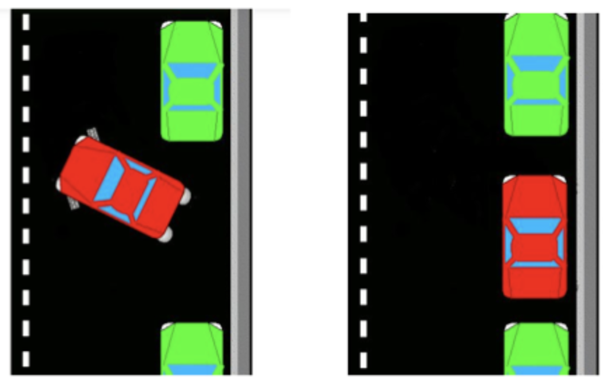

## Parallel Parking

This is a quick project that gives a chance to write code that controls a simulated car.

String together squences of task together to successfully perform parallel park simulated car in a line of other car, without hitting any of the other cars.

